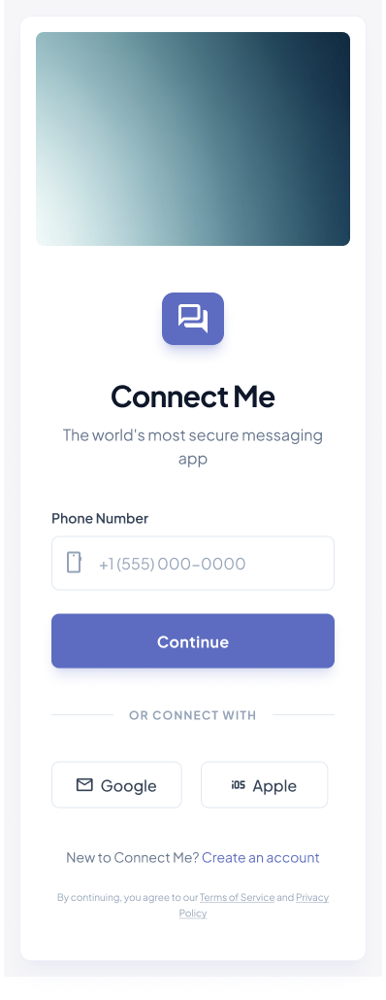
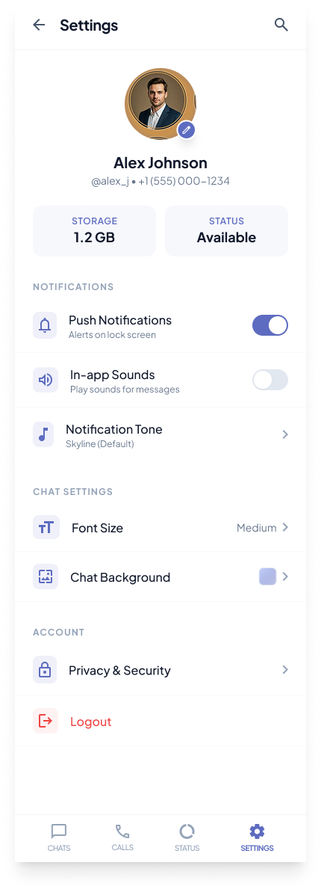

# ConnectMe

Spring Boot 4.0.5 + React 18 기반 실시간 메신저 웹 애플리케이션

## Screenshots

<table>
  <tr>
    <td></td>
    <td></td>
    <td></td>
    <td></td>
  </tr>
  <tr>
    <td align="center">로그인</td>
    <td align="center">채팅 목록</td>
    <td align="center">1:1 채팅방</td>
    <td align="center">그룹 채팅방</td>
  </tr>
  <tr>
    <td></td>
    <td></td>
    <td></td>
    <td></td>
  </tr>
  <tr>
    <td align="center">그룹 생성</td>
    <td align="center">그룹 목록</td>
    <td align="center">미디어/파일</td>
    <td align="center">설정</td>
  </tr>
</table>

## Tech Stack

| Layer | Stack |
|---|---|
| Backend | Spring Boot 4.0.5 · Java 21 · Spring Security · JPA/Hibernate · WebSocket |
| Frontend | React 18 · Vite 5 · react-router-dom v6 · CSS Modules |
| Database | MySQL 8.0 · Redis 7 |
| Auth | JWT (Access + Refresh Token) · BCrypt |
| Infra | Docker Compose · Gradle 멀티모듈 |

## Module Structure

```
sns_project/
├── connect-me-api/        # 메인 앱 — Controller, Service (포트 8080)
├── connect-me-domain/     # 엔티티, Repository
├── connect-me-common/     # 공통 예외처리, 유틸리티
└── connect-me-frontend/   # React SPA (포트 3000)
```

## Getting Started

### Prerequisites

- Java 21
- Node.js 18+
- Docker & Docker Compose

### 1. 인프라 실행 (MySQL + Redis)

```bash
docker-compose up -d
```

### 2. 백엔드 실행

```bash
./gradlew :connect-me-api:bootRun
```

### 3. 프론트엔드 실행

```bash
cd connect-me-frontend
npm install
npm run dev
```

프론트엔드(`localhost:3000`)는 `/auth`, `/users` 경로를 백엔드(`localhost:8080`)로 자동 프록시합니다.

### 4. 테스트

```bash
./gradlew test
```

## API Endpoints

| Method | Path | Description | Auth |
|--------|------|-------------|------|
| POST | /auth/register | 회원가입 | ❌ |
| POST | /auth/login | 로그인 | ❌ |
| POST | /auth/refresh | 토큰 갱신 | ❌ |
| POST | /auth/logout | 로그아웃 | ✅ |
| GET | /users/me | 내 프로필 조회 | ✅ |
| PATCH | /users/me | 내 프로필 수정 | ✅ |
| GET | /friends | 친구 목록 | ✅ |
| GET | /friends/requests | 받은 친구 요청 목록 | ✅ |
| POST | /friends/request/{targetId} | 친구 요청 | ✅ |
| PATCH | /friends/{friendId}/accept | 친구 수락 | ✅ |
| PATCH | /friends/{friendId}/reject | 친구 거절 | ✅ |
| PATCH | /friends/{friendId}/block | 친구 차단 | ✅ |
| DELETE | /friends/{friendId} | 친구 삭제 | ✅ |
| POST | /chat-rooms/direct | 1:1 채팅방 생성 | ✅ |
| POST | /chat-rooms/group | 그룹 채팅방 생성 | ✅ |
| GET | /chat-rooms | 내 채팅방 목록 | ✅ |
| GET | /chat-rooms/{roomId} | 채팅방 상세 | ✅ |
| PATCH | /chat-rooms/{roomId} | 채팅방 이름 수정 | ✅ |
| POST | /chat-rooms/{roomId}/members | 멤버 초대 | ✅ |
| DELETE | /chat-rooms/{roomId}/members/me | 채팅방 나가기 | ✅ |
| DELETE | /chat-rooms/{roomId}/members/{targetUserId} | 멤버 강퇴 (OWNER) | ✅ |

## Error Response Format

```json
{
  "code": "ERROR_CODE",
  "message": "에러 설명"
}
```

## Implementation Status

| Phase | Domain | Status |
|-------|--------|--------|
| 1-1 | User 엔티티 · Repository | ✅ |
| 1-2 | 인증 (JWT · BCrypt · Refresh Token) | ✅ |
| 1-3 | 회원 API (GET /users/me, PATCH /users/me) | ✅ |
| 2 | 친구 (요청/수락/차단/삭제) | ✅ |
| 3 | 채팅방 (1:1 · 그룹) | ✅ |
| 4 | 메시지 · WebSocket | 🚧 |
| 5 | 알림 (Notification) | ⬜ |
| 6 | 인프라 (MySQL · Redis · Docker) | ⬜ |

## Branch Strategy

```
main          ← 프로덕션
└── develop   ← 개발 통합
    └── feature/*  ← 기능 개발
```

PR은 `feature/*` → `develop`으로만 생성합니다. `main` 직접 병합 금지.

## Docs

- [DB Schema](docs/db-schema.md)
- [Architecture](docs/architecture.md)