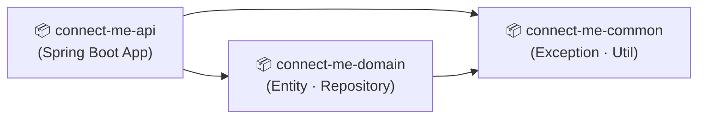
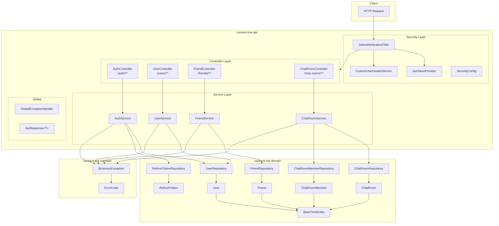
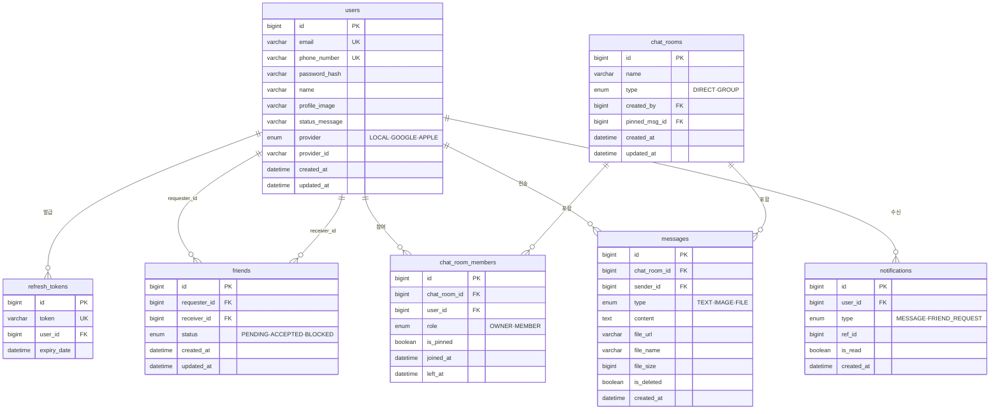
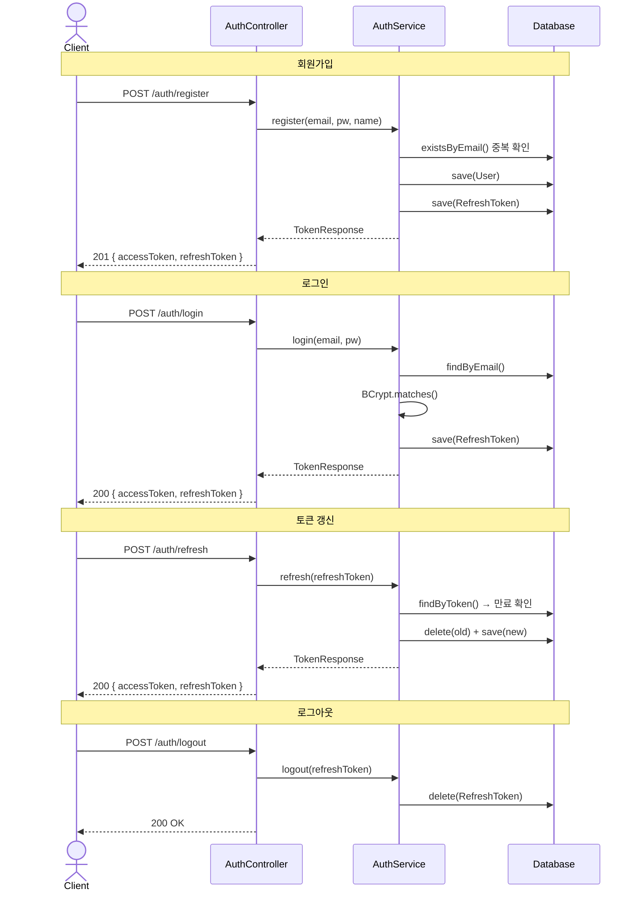
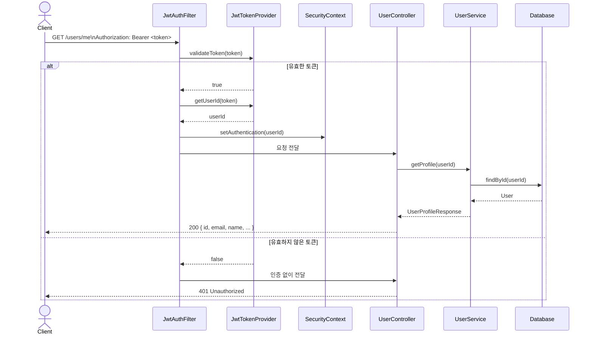
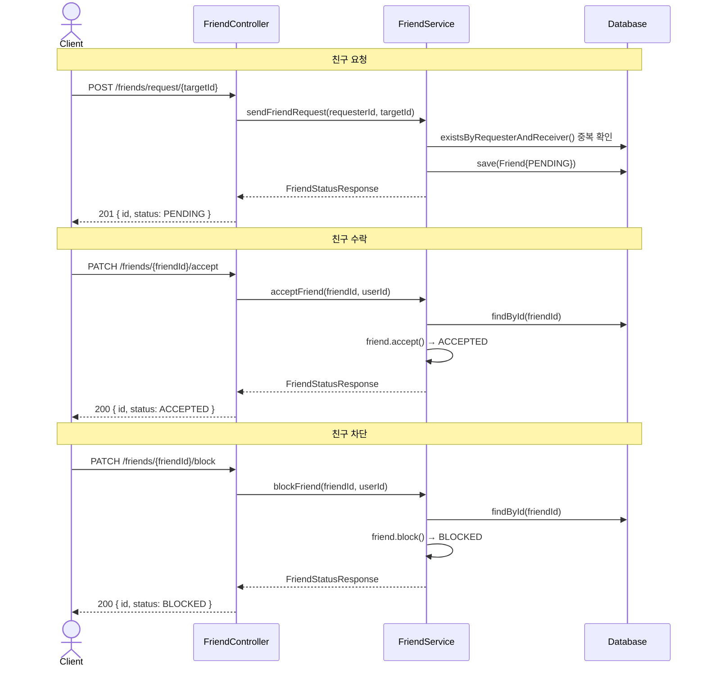
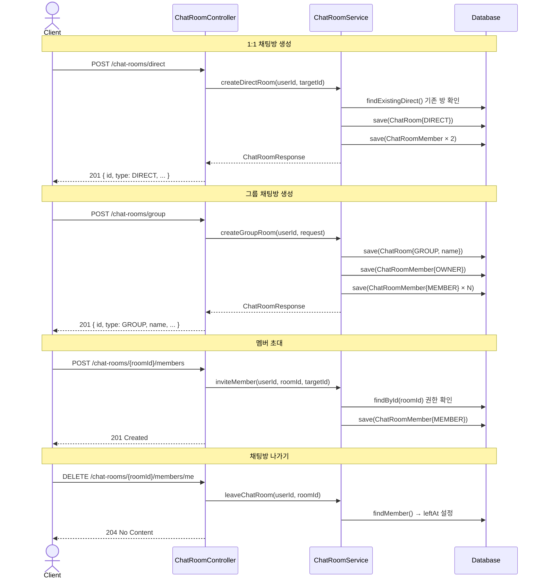

# ConnectMe Architecture

## 1. 멀티 모듈 의존성

---

## 2. 레이어 아키텍처

---

## 3. 도메인 엔티티 관계

---

## 4. API 요청 흐름

### 4-1. 인증 흐름

### 4-2. 보호된 리소스 접근 흐름

### 4-3. 친구 흐름

### 4-4. 채팅방 흐름

---

## 5. 구현 현황

| Phase | 도메인 | 상태 |
|-------|--------|------|
| 1-1 | User 엔티티 · Repository | ✅ 완료 |
| 1-2 | 인증 (JWT · BCrypt · Refresh Token) | ✅ 완료 |
| 1-3 | 회원 API (GET /users/me, PATCH /users/me) | ✅ 완료 |
| 2 | 친구 (Friend 엔티티 · 요청/수락/차단/삭제 API) | ✅ 완료 |
| 3 | 채팅방 (ChatRoom · ChatRoomMember · 1:1/그룹 API) | ✅ 완료 |
| 4 | 메시지 · WebSocket | ⬜ 미구현 |
| 5 | 알림 (Notification) | ⬜ 미구현 |
| 6 | 인프라 (MySQL · Redis · Docker) | ⬜ 미구현 |

## 6. API 엔드포인트 목록

| 메서드 | 경로 | 설명 | 인증 |
|--------|------|------|------|
| POST | /auth/register | 회원가입 | ❌ |
| POST | /auth/login | 로그인 | ❌ |
| POST | /auth/refresh | 토큰 갱신 | ❌ |
| POST | /auth/logout | 로그아웃 | ✅ |
| GET | /users/me | 내 프로필 조회 | ✅ |
| PATCH | /users/me | 내 프로필 수정 | ✅ |
| GET | /friends | 친구 목록 조회 | ✅ |
| GET | /friends/requests | 받은 친구 요청 목록 | ✅ |
| POST | /friends/request/{targetId} | 친구 요청 전송 | ✅ |
| PATCH | /friends/{friendId}/accept | 친구 요청 수락 | ✅ |
| PATCH | /friends/{friendId}/reject | 친구 요청 거절 | ✅ |
| PATCH | /friends/{friendId}/block | 친구 차단 | ✅ |
| DELETE | /friends/{friendId} | 친구 삭제 | ✅ |
| POST | /chat-rooms/direct | 1:1 채팅방 생성 | ✅ |
| POST | /chat-rooms/group | 그룹 채팅방 생성 | ✅ |
| GET | /chat-rooms | 내 채팅방 목록 | ✅ |
| GET | /chat-rooms/{roomId} | 채팅방 상세 조회 | ✅ |
| PATCH | /chat-rooms/{roomId} | 채팅방 이름 수정 | ✅ |
| POST | /chat-rooms/{roomId}/members | 멤버 초대 | ✅ |
| DELETE | /chat-rooms/{roomId}/members/me | 채팅방 나가기 | ✅ |
| DELETE | /chat-rooms/{roomId}/members/{targetUserId} | 멤버 강퇴 (OWNER) | ✅ |